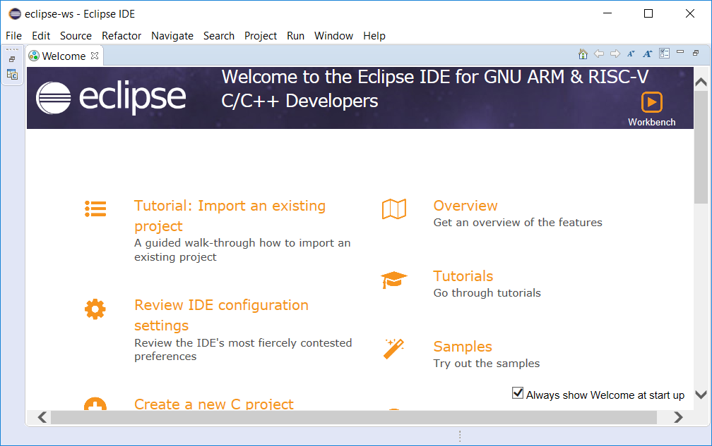
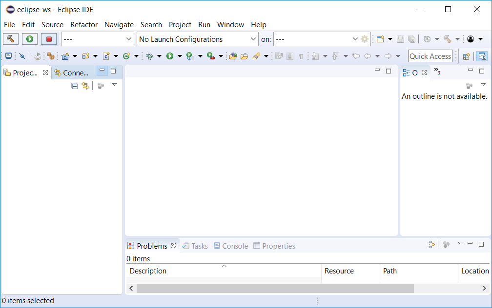
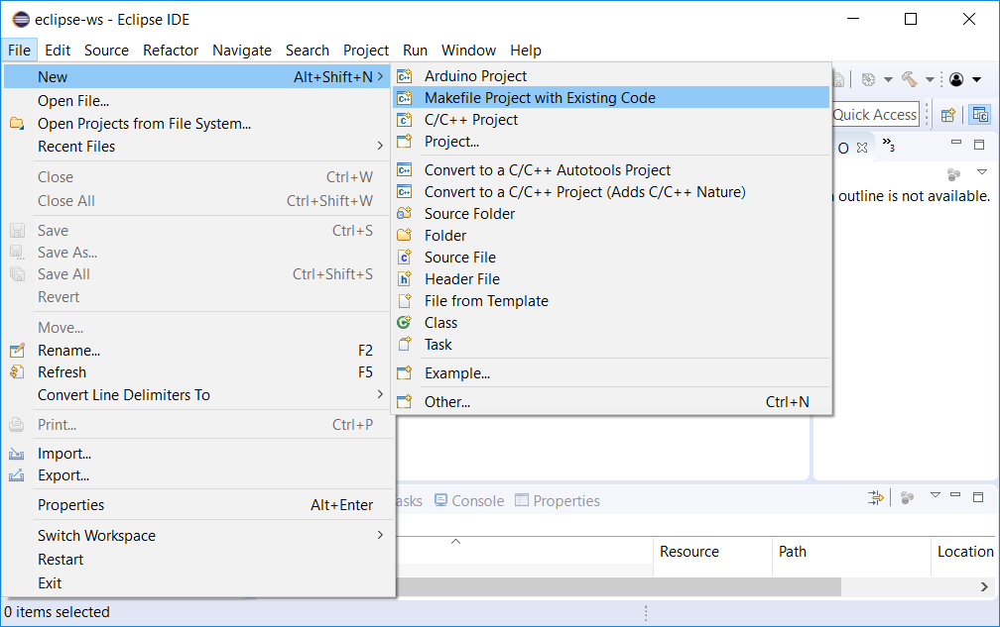
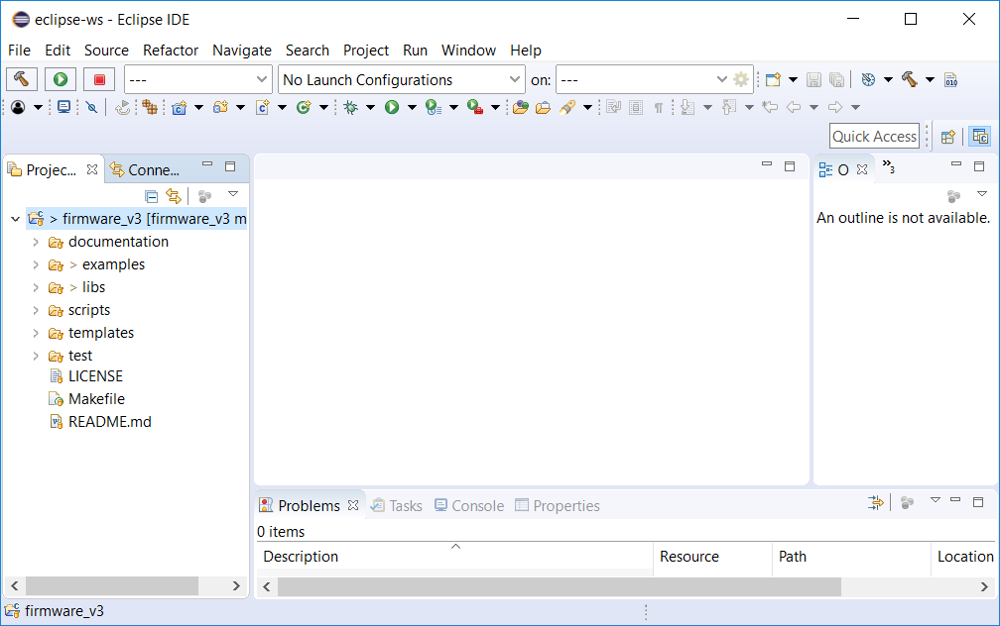
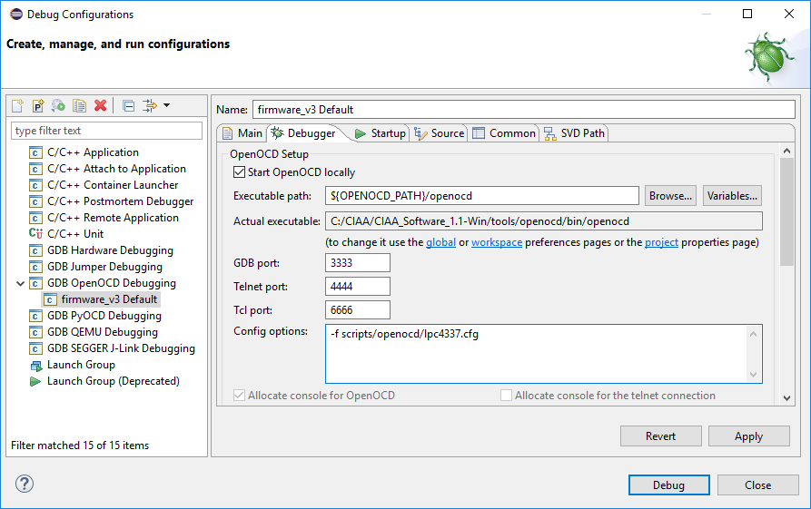
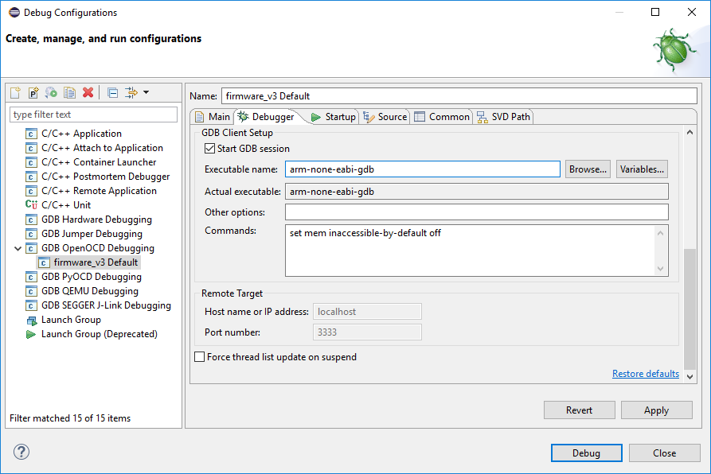

# Configuración inicial de Eclipse para trabajar con el proyecto Firmware v3

### Abrir Eclipse

Recordar abrir Eclipse desde el Launcher. Esto traerá las variables de entorno necesarias para ubicar las herramientas externas para compilación y depuración.

### Workspace

Al abrir el Eclipse solicita seleccionar la carpeta a utilizar como espacio de trabajo (Workspace), elegir dentro de la ruta donde descomprimieron el Launcher la carpeta:

```
<rutaDondeDescomprimiElLauncher>/workspaces/eclipse-ws
```


### Ventana inicial

Al iniciar el Eclipse muestra una pestaña de bienvenida (Wellcome) como la siguiente:



Debe cerrar esta pestaña para que se muestre el árbol de proyectos y el espacio del editor de archivos:



### Abrir Proyecto de Firmware para programar en asembler, C o C++

Primero debemos clonar o descargar el Proyecto a abrir, en este caso firmware_v3:

https://github.com/epernia/firmware_v3

Ubicar la carpeta Firmware v3 dentro de la carpeta del Launcher. 

Luego en Eclipse ir al menú:

```
New --> Makefile Project with Existing Code
```



En la ventana que se abre deberá:

- Elegir mediante "Browse" la carpeta ```firmware_v3```
- Tildar en Languages ```C``` y ```C++```
- Elegir como Toolchain ```ARM Cross GCC```


Una vez realizado presione "Finish" y verá el Proyecto "firmware_v3" en el árbol de proyectos:



**Nota**: puede tener múltiples proyectos abiertos en simultáneo. En esta materia utilizaremos **solo este proyecto** que se compone de **múltiples programas** (los ejemplos que trae más los programas que realizaremos nosotros).

### Configurar opciones de compilación

Se debe hacer clock derecho sobre el proyecto "firmware_v3" y luego en la opción"Properties":


En la ventana que se abre debe hacer click sobre "C/C++ Build" y en la parte derecha debe:

- Destildar la opción "Use default build command".
- En "Build command" escribir ```make``` en el campo de texto.

Presionar "Apply and Close" para aplicar la configuración.


De esta forma ya podrá compilar el proyecto mediante el icono del martillo (Build) o mediante la opción "Build" presionando el botón derecho sobre el proyecto.


Al presionar "build" se compila el programa dando como resultado lo siguiente:


**Nota:** observe que se ve: 

- Los bytes ocupados en cada área de memoria (ver apunte de printf() y scanf() para comprenderlo).
- El programa que fue compilado dentro del proyecto, en este caso llamado "app" en la carpeta "examples/c" dentro de "firmware_v3".
- La plataforma de hardware para la cual se compiló el programa, en este caso "EDU-CIAA-NXP".

### Configuración de la descarga y depuración del programa sobre el hardware

Ubique el ícono del bicho verde (debbug) , presione sobre la flecha hacia abajo a la derecha de este icono y en la ventana que se despliega la opción "Debug Configurations..."


Esto abre la ventana de configuraciones:


A la izquierda realizar doble click sobre "GDB OpenOCD Debugging" que crea una nueva configuración:


En esta ventana se puede ver que proyecto está seleccionado (en este caso ```firmware_v3```) y el programa a descargar/depurar (campo de texto C/C++ Application:). 

Mediante el botón "Search Project.." puede elegir que programa va a descargar/depurar. En este caso como existe un único programa compilado muestra ese (```app.elf```):


Seleccionarlo y presionar "Ok".


Ir a la pestaña "Debugger" donde deberá completar lo siguiente:

- Executable path: ```${OPENOCD_PATH}/openocd```
- Config options: ```-f scripts/openocd/lpc4337.cfg```



Deslice la pantalla más abajo y configure en la sección "GDB Client Setup":

- Executable name: ```arm-none-eabi-gdb```



Con esto ya se encuentra configurado el Eclipse para depurar. 

### Probar el funcionamiento de la depuración sobre el hardware

Para probarlo presione sobre el botón "Debug". Aparecerá un mensaje como el siguiente la primera vez que avisa que el Eclipse pasará de la perspectiva de programación, a la de depuración (esto hace que se reacomoden vairos menues para facilitar la depuración). Presione "Remember my decision" y "Switch" para que no la muestre cada vez:


Cuando el programa se descargó a la plataforma y empezó a ejecutarlo dentendrá su ejecución al inicio de la función main(), mediante los botones de control de ejcución y breakpoints podremos controlar el programa que se ejecuta en la placa desde nuestra PC:

En este caso se puso uin beakpoint en la función boardConfig() como ejemplo:

### Depurar otro programa dentro del mismo proyecto

Simplemente deberá compilar el otro porgrama y luego abrir la ventana "Debug Configurations" y mediante el botón "Search Project.." puede elegir que programa va a descargar/depurar:


Liego simplemente presionar sobre debug, el resto de las configuraciones que realizamos se hace una única vez.
